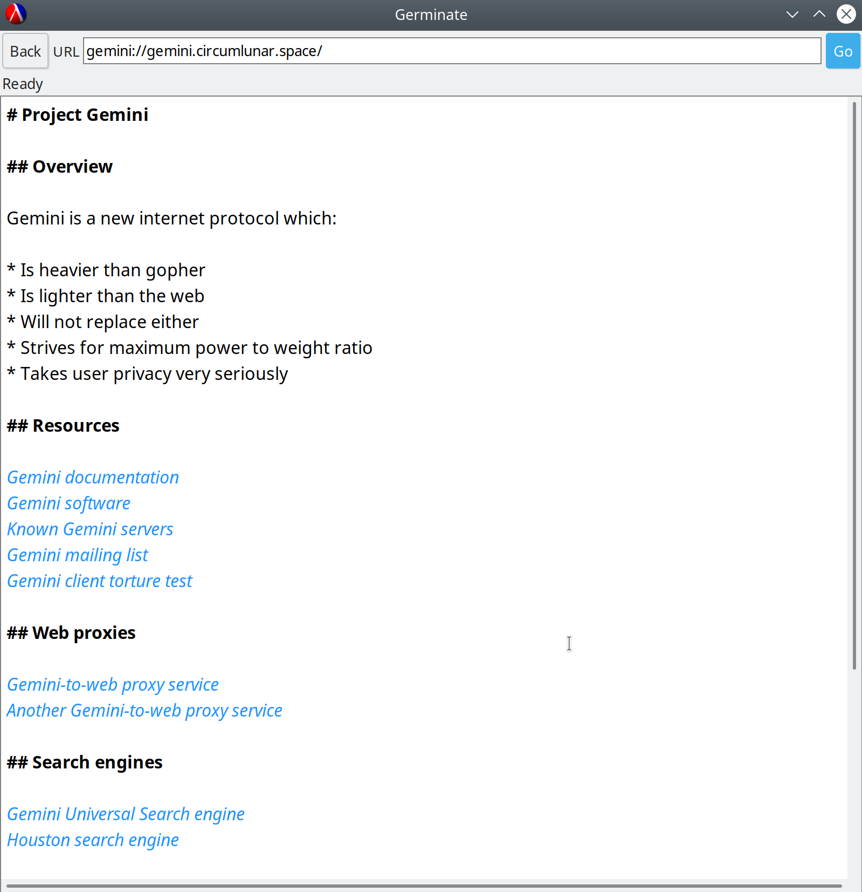
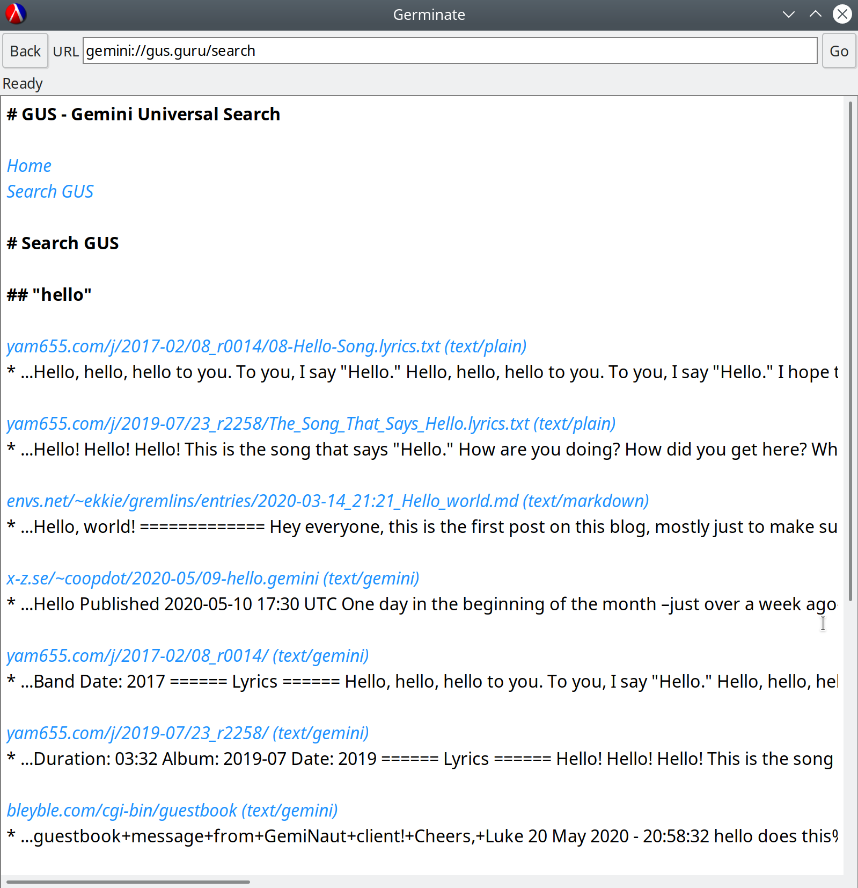

# Germinate

Germinate is an ultra-minimal browser for the [Gemini](https://gemini.circumlunar.space/) protocol, a lightweight alternative to the World Wide Web.

It's written in a literate programming style using Racket, so the source code is hopefully a good introduction to the Gemini protocol itself.

To run the browser, you can use a binary distribution from the releases page or run the code in [DrRacket](https://docs.racket-lang.org/drracket/interface-essentials.html).

